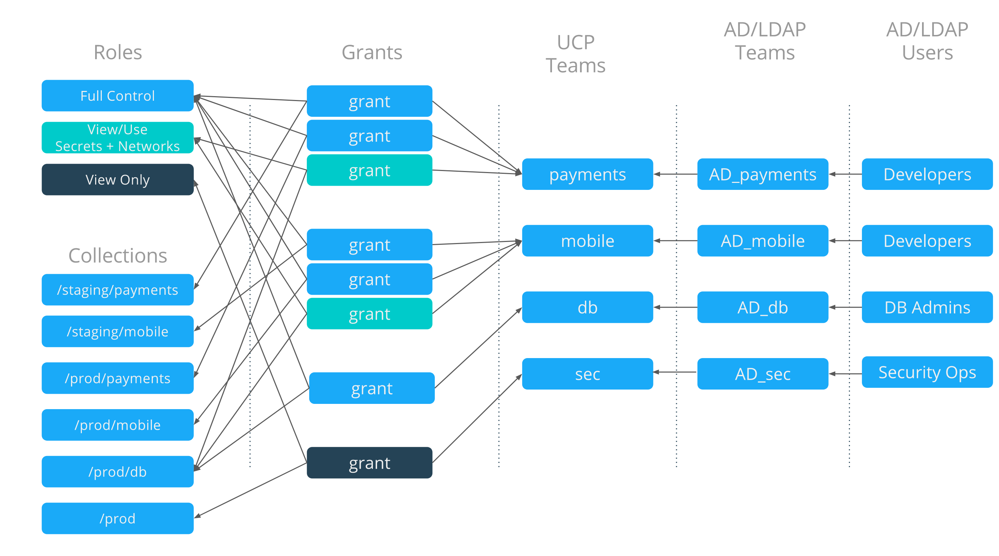
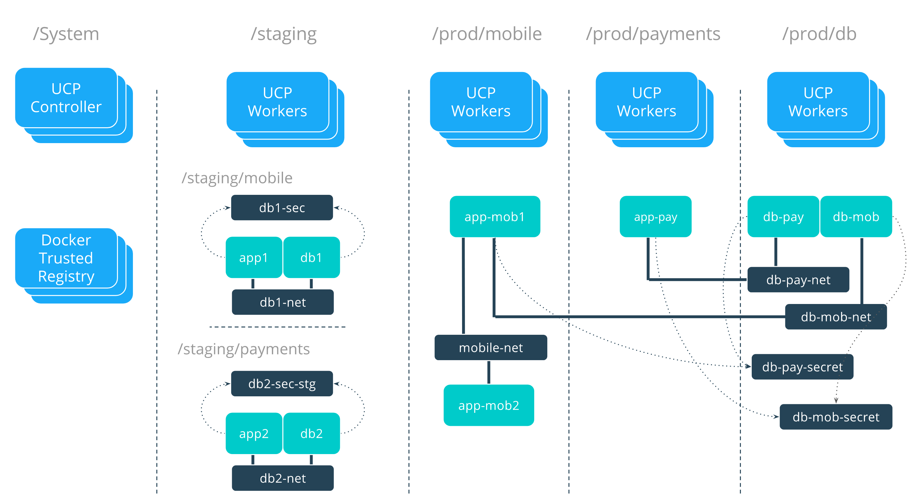

This example describes a typical design for access control on Docker Enterprise. 

## Access Requirements

In this scenario there are three types of users: Developers, DB Admins, and Security Operations. These types of users are further segmented in to teams with specific permissions that grant access and control on cluster resources. There are two broad zones in which apps are deployed, Staging and Production. 

### Teams
- `Payments` - This team is responsible for applications that process backend payments. It should have the ability to deploy, edit, destroy, and view all cluster resources within the Payments zone. 
- `Mobile` - This team is responsible for applications that are the backend for mobile apps. It should have the ability to deploy, edit, destroy, and view all cluster resources within the Mobile zone.
- `DB` - This team manages all production databases centrally as a resource for other applications to use. It should have the ability to deploy, edit, destroy, and view all cluster resources within the DB zone. This team does not manage the staging DBs.
- `Security` - This team audits all applications in production. It should have the ability to view all resources that are in production.

### Collections
There are different tiers of collections that segment resources within the cluster

- `/staging` is shared pool of resources and nodes that can be used by all of the developer teams (Payments and Mobile) to deploy staged applications in. 
- `/prod/mobile` is a segregated collection of nodes for the Mobile team.
- `/prod/payments` is a segregated collection of nodes for the Payments team.
- `/prod/db` is a segregated collection of nodes for production databases to be deployed in to.
- `/System` is a default collection of nodes where the Docker Enterprise control infrastructure runs. This is not accessible or viewable to any application teams.

### Roles
- `Full Control` allows a user to deploy, edit, destroy, and view any cluster resources.
- `View Only` provides only visibility to resources.
- `View/Use Secrets + Networks` is a custom role created to allow Payments and Mobile teams to connect to and use networks and secrets that are created by the DB team. Through this role networks and secrets become shared resources between two different collections.

### Access Mapping
The following structure shows the full mapping between individual users and the resources that they are granted access to. Explicit Grants tie together users, individual resources, and the actions that are permitted against those resources. In this example, users are pulled in to UCP via AD teams that are created and administered externally to UCP by a centralized Identity Team.

 

### UCP Resources
The following diagram shows how resources are segmented within the cluster. Nodes are placed in to collections so that applications in different security zones do not share the same physical or virtual hardware. 

- `/staging` hosts all of the staging applications on the same shared hardware however `/staging/mobile` and `/staging/payments` limits the visibility of the virtual resources like containers, networks, and secrets.
- `/prod` is segmented in to three further sub-collections to provide dedicated hardware to each tier and application.

 

