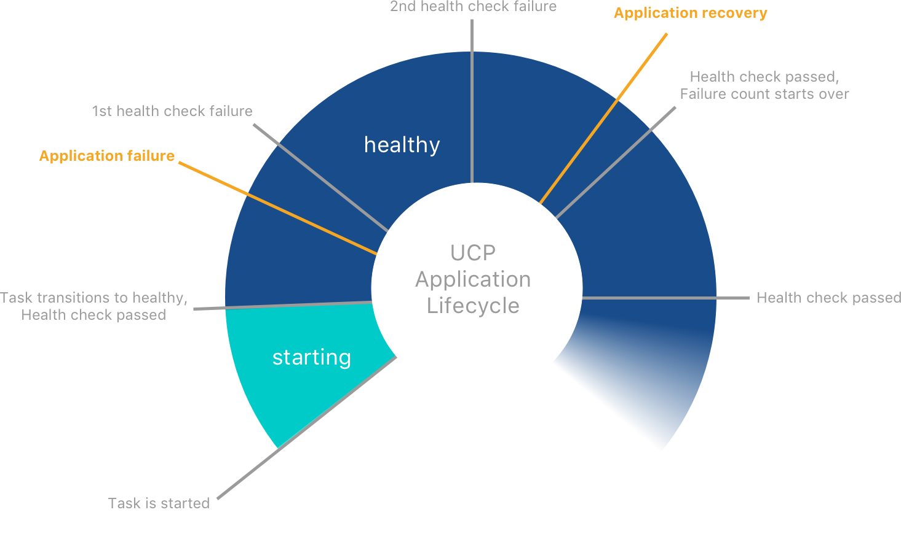
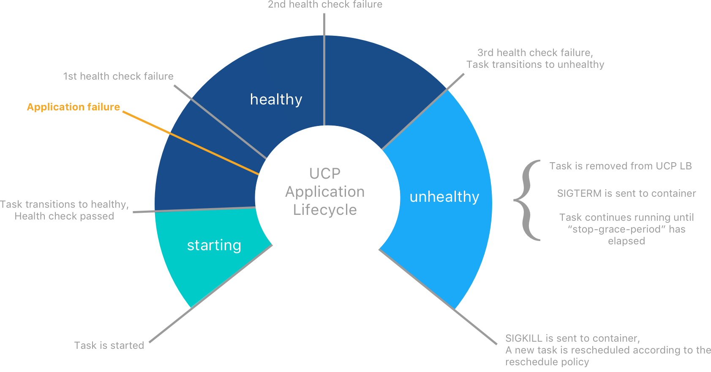

Application resilliency is a complex, but extremely important topic, especially for distributed applications. Resilliency of distributed systems is influenced by many charachteristics but one of the most important of these is the ability to detect and recover from application failure. Docker Swarm has a full suite of features that can be used to monitor application health and also react appropriately to failure. 

There are two policies in the Docker Engine and Swarm that govern failure & recovery - __health check policy__ and __restart policy__. Each of these policies is a group of configurable items that influence how containers & services are monitored and recovered.

####Health Check Policy
The health check will first run `interval` seconds after the container is started, and then again `interval` seconds after each previous check completes.

If a single run of the check takes longer than `timeout` seconds then the check is considered to have failed.

It takes `retries` consecutive failures of the health check for the container to be considered unhealthy.
```
curl --fail http://localhost:5000/health
--interval=15s
--timeout=5s 
--retries=3
```

####Restart Policy
```
--restart-condition always
--stop-grace-period 30s
--restart-max-attempts 3
```

####Application Failure and Recovery


####Application Failure and Reschedule



 