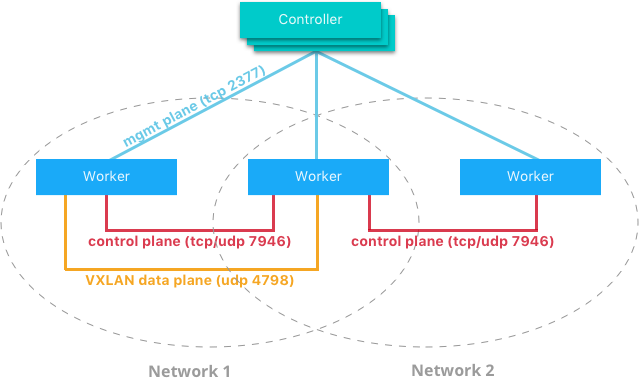

### Swarm Cluster Traffic Architecture
In a Docker Swarm cluster there are different types of network traffic that provide communications for various cluster functions. The three types of cluster traffic communicate on different ports. They are as follows:

#### Swarm Management Plane
Management plane traffic is the control messages between the Swarm controllers and the workers. This kind of traffic sends various commands between workers and controllers such as a new task that is sent to a worker to be executes or a heartbeat that communicates the health of a worker to the controllers. The default port for management traffic is `tcp 2377` (unless configured otherwise) and flows directly between workers and managers.

#### Swarm Control Plane
Control plane traffic carries network information between all nodes in the cluster. This includes information such as the location of containers in the cluster and DNS to IP mappings. The port used for control traffic is not configurable and uses `tcp & udp 7946`. The flow of this traffic is directly between worker nodes. Control plane traffic is also scoped to nodes which belong to the same Docker network. This reduces the amount of control plane traffic and aids in security. Two worker nodes that do not belong to the same Docker network will not communicate control plane traffic.

#### Swarm Data Plane
The data plane carries application traffic between containers or from containers to hosts outside of the cluster. The transport for data plane traffic will differ depending on the type of Docker networking driver that is being used for containers. If using a driver like the `bridge` driver, then application traffic will be exposed on and use whatever ports are configured by the operater. In the case of the `overlay` driver, application traffic is transported using VXLAN. This utilizes port `udp 4798` and flows directly between the worker nodes where the communicating containers are.




## Out of Band Management for Docker Swarm
Segmentation of cluster management and control traffic from application traffic is a good practice that helps increase cluster stability and security. This ensures that critical cluster control traffic cannot be adversely affected by congestion from applications.  Proper design of an out of band management network should enforce network isolation and not allow application traffic to traverse the management network. 

The following example shows how Swarm parameters can be used to segment traffic types. The hosts that are being used each have two network interfaces, with one designated for application traffic and the other for control & mgmt traffic.

```
node1 $ docker -v
Docker version 17.06.0-ce-rc1, build 7f8486a

node1 $ ifconfig | grep -B 2 'inet addr'
eth1      Link encap:Ethernet  HWaddr 08:00:27:97:d8:88
          inet addr:192.168.1.10  Bcast:192.168.1.255  Mask:255.255.255.0
--

eth2      Link encap:Ethernet  HWaddr 08:00:27:2e:74:3f
          inet addr:192.168.2.10  Bcast:192.168.2.255  Mask:255.255.255.0
...

node1 $ docker swarm init --advertise-addr eth1 --datapath-addr eth2

node2 $ docker swarm join --token SWMTKN-1-5fruwh3u3kq5tn817hft4zqzau5e3el8yk59i24eprnoovpssh-bolvsn6q8qa5r3jqdavxmdmql --data-path-addr eth2 192.168.1.10:2377

node1 $ docker node ls
ID                            HOSTNAME            STATUS              AVAILABILITY        MANAGER STATUS
7uvfpchlnk72dokpm9jbnlqca *   node1               Ready               Active              Leader
9khogl9595f9pe5pdwy6ckry9     node2               Ready               Active
```

Now we create a test network and service to demonstrate that application traffic will traverse the data interface `eth2`.

```
node1 $ docker network create -d overlay ovl

node1 $ docker service create --mode global --name mgmt-test-service --network ovl nicolaka/netshoot netgen mgmt-test-service 5000

node1 $ docker service ps mgmt-test-service
ID                  NAME                                          IMAGE                                                                                                 NODE                DESIRED STATE       CURRENT STATE           ERROR               PORTS
mgcsla9qw7zv        mgmt-test-service.9khogl9595f9pe5pdwy6ckry9   docker.io/nicolaka/netshoot   node2               Running             Running 4 minutes ago
qc2lpche44rg        mgmt-test-service.7uvfpchlnk72dokpm9jbnlqca   docker.io/nicolaka/netshoot   node1               Running             Running 4 minutes ago
```

Verify that management traffic and application traffic are using the correct interfaces.

```
node1 $ tcpdump -n -i eth1
14:56:05.283931 IP 192.168.1.20.43104 > 192.168.1.10.2377: Flags [.], ack 134, win 1246, options [nop,nop,TS val 287786 ecr 381117], length 0
14:56:05.479424 IP 192.168.1.10.7946 > 192.168.1.20.7946: UDP, length 64
    
node1 $ tcpdump -n -i eth2
14:56:39.796881 IP 192.168.2.20.54557 > 192.168.2.10.4789: VXLAN, flags [I] (0x08), vni 4097
IP 10.0.0.4.46828 > 10.0.0.3.5000: Flags [P.], seq 1:14, ack 1, win 683, options [nop,nop,TS val 296415 ecr 389745], length 13
```

From the output we can see that Swarm management traffic (port `2377`) and Swarm network control plane traffic (port `7946`) are using the management network on `eth1`. The data plane traffic (VXLAN port `4789`) is using the data network on `eth2`. 
 


